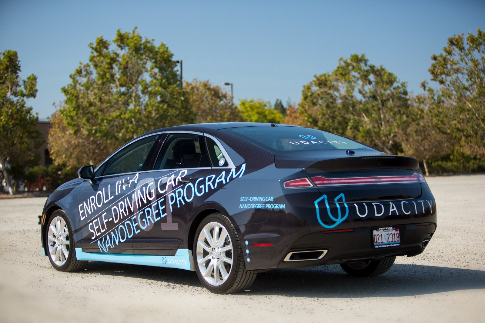

# Self-Driving Car Projects.

 

This repository contains all projects from the [Self-Driving Car Nanodegree](https://www.udacity.com/drive) by [https://www.udacity.com/](Udacity) and will be updated with my progress.

The Nanodegree is divided in two modules, and is focus on fundamental skills in each core area of the self-driving car stack.

The focus of Module 1 is applying machine learning to automotive tasks: deep learning, convolutional neural networks, support vector machines, and computer vision.

In Term 2, students build the core robotic functions of an autonomous vehicle system: sensor fusion, localization, and control. This is the muscle of a self-driving car!

## Module 1
#### Computer Vision, Deep Learning, and Sensor Fusion

The techniques used in this first term will teach the car to detect lane lines, predict steering angle, and more all based on just camera data.

| Project |              Title              | Language |                       Techniques                       |
|:-------:|:-------------------------------:|:--------:|:------------------------------------------------------:|
|    01   |        [Finding Lane Lines](P01-Finding-Lane-Lines/P01-FindingLaneLines.ipynb)       |  Python  | Canny Edge Detection, Hough Transform, Region Masking. |
|    02   |      Advanced Lane Finding      |          |                                                        |
|    03   |     Traffic Sign Classifier     |          |                                                        |
|    04   |        Behavioral Cloning       |          |                                                        |
|    05   | Extended Kalman Filters Project |          |                                                        |

## Module 2
#### Localization, Path Planning, Control, and System Integration
